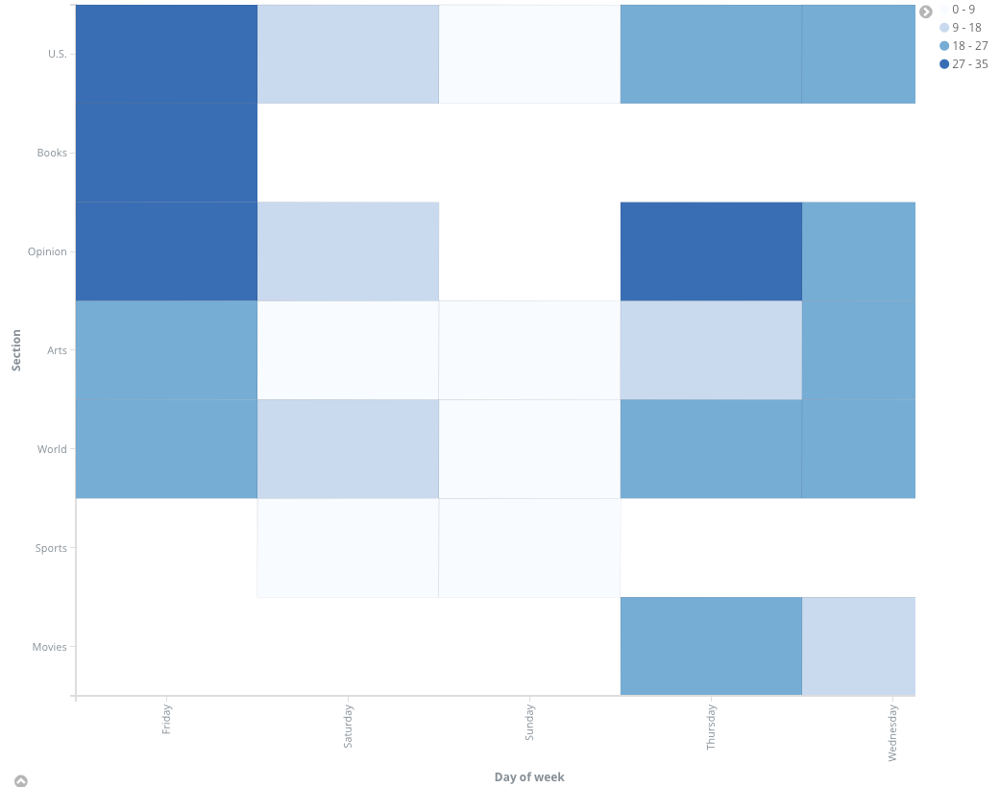

# NYTimes-pipeline
A project for a data engineering class: we built a big data pipeline using the NY Times Newswire API, Python, Kafka, Spark and ElasticSearch/Kibana.

Starting point of the pipeline is an API from the New York Times (NYT). The extracted data will then be placed into an intermediate  message queue (Kafka). Consequently, the data in Kafka will be extracted and used to visualize three queries. One of those queries uses Spark in order to perform machine learning, LDA on article abstracts to model topics. All the queries will eventually be visualized using ElasticSearch and Kibana.

Example heatmap: 

Example of modeled topic: 
